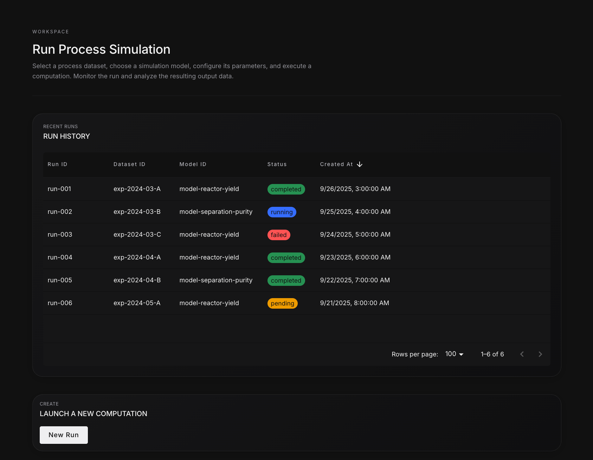

# STRUDEL Example: Scientific Data Visualization

This repository demonstrates the STRUDEL Design System applied to scientific data visualization workflows. It showcases how to implement UI templates for common scientific task flows with a focus on data exploration, quality benchmarking, and computational analysis.

## Project Overview

The STRUDEL Example Mock Charts project provides a practical implementation of the STRUDEL framework, featuring:

- **Dataset Exploration**: Browse, filter, and preview scientific datasets with interactive visualizations
- **Quality Benchmarking**: Compare data readiness scores, anomaly rates, and drift metrics
- **Computational Workflows**: Execute process simulations and computational models on datasets
- **Modern UI/UX**: Clean, scientific-focused interface built with React and Material UI

## Technologies Used

- [**React**](https://react.dev/): Component-based JavaScript library for building UIs
- [**TypeScript**](https://www.typescriptlang.org/): Typed superset of JavaScript for enhanced safety
- [**Vite**](https://vite.dev/): Fast frontend build tool
- [**Material UI**](https://mui.com/material-ui/getting-started/): React component library based on Material Design
- [**TanStack Router**](https://tanstack.com/router/latest): Type-safe router with data fetching capabilities
- [**Plotly.js**](https://plotly.com/javascript/): Interactive graphing library for scientific visualizations
- [**D3**](https://d3js.org/): Data visualization library for advanced charting
- [**ESLint**](https://eslint.org/): Pluggable linting utility for JavaScript and JSX
- [**Prettier**](https://prettier.io/): Code formatter for consistent style

## Screenshots




## Getting Started

### Prerequisites

- Node.js (version ^18.18.0 || >=20.0.0)
- npm

### Installation

1. Clone the repository:

   ```
   git clone https://github.com/sprblm/studel-example-mock.git
   cd studel-example-mock
   ```

2. Install dependencies:

   ```
   npm install
   ```

3. Start the development server:

   ```
   npm start
   ```

   Or alternatively:

   ```
   npm run dev
   ```

4. Open your browser to [http://localhost:5175](http://localhost:5175) (or the next available port)

### Environment Configuration

Create a `.env` file in the root directory based on the `.env.example` file to customize your environment variables:

```
VITE_PORT=5175
VITE_BASE_URL=/
```

## Project Structure

```
src/
├── components/        # Reusable UI components
├── context/          # React context providers
├── hooks/            # Custom React hooks
├── pages/            # Page components (routes)
│   ├── explore-data/    # Dataset exploration flow
│   ├── quality-benchmark/ # Quality assessment flow
│   └── run-computation/   # Computational workflow flow
├── types/            # TypeScript type definitions
├── utils/            # Utility functions
├── App.tsx          # Main application component
├── theme.tsx        # Material UI theme configuration
└── main.tsx         # Application entry point
```

## Available Scripts

- `npm start` or `npm run dev` - Start development server
- `npm run build` - Build for production
- `npm run preview` - Preview production build locally
- `npm run lint` - Check code for linting errors
- `npm run lint:fix` - Automatically fix linting errors
- `npm run prettier` - Check code formatting
- `npm run prettier:fix` - Automatically format code
- `npm run style:all` - Run type checking, linting, and formatting
- `npm run cy:test` - Run Cypress end-to-end tests
- `npm run cy:open` - Open Cypress test runner
- `npm run deploy` - Deploy to GitHub Pages

## Task Flows

The application implements three primary scientific task flows:

1. **Explore Data**: Browse, filter, and preview scientific datasets with interactive visualizations
2. **Quality Benchmark**: Compare data readiness scores, anomaly rates, and drift metrics across laboratory datasets
3. **Run Computation**: Execute process simulations and computational models on your datasets with collaborative presets

## Contributing

We welcome contributions! Please read our [CONTRIBUTING.md](CONTRIBUTING.md) for guidelines on how to contribute to this project.

## License

This project is licensed under the terms found in the [LICENSE](LICENSE) file.

## Acknowledgments

This project builds upon the STRUDEL Design System for scientific UIs. For more information about STRUDEL, visit [strudel.science](https://strudel.science).
